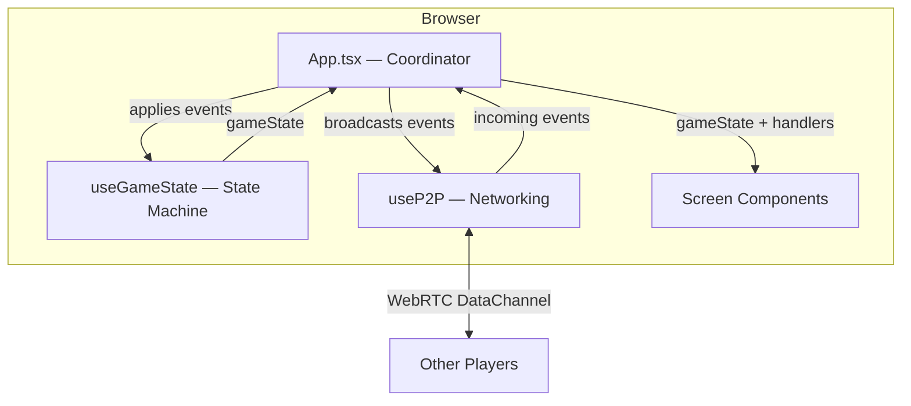
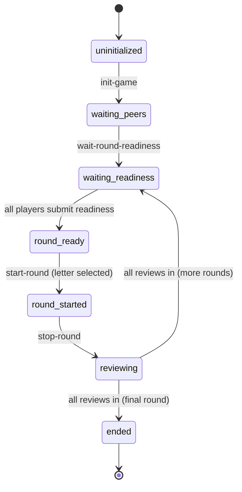
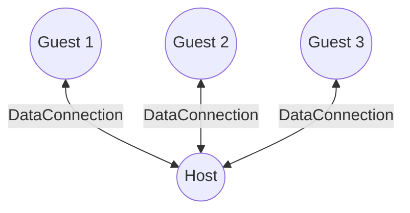
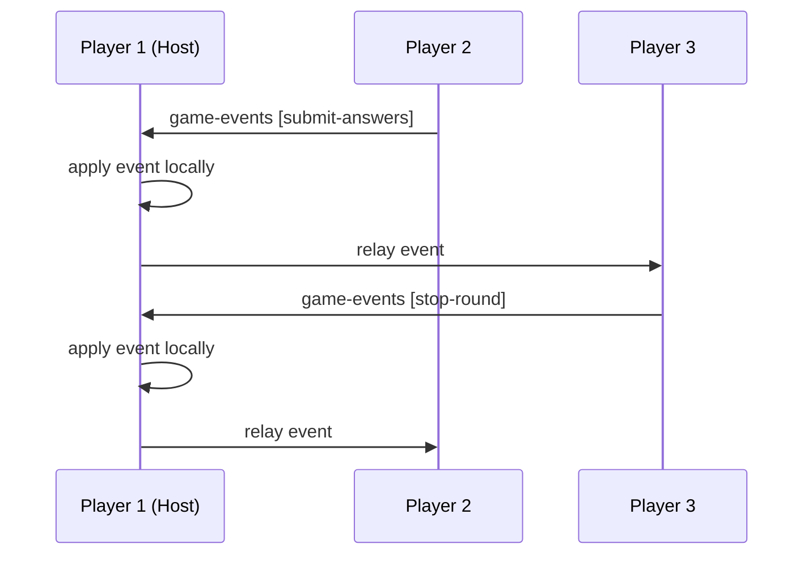
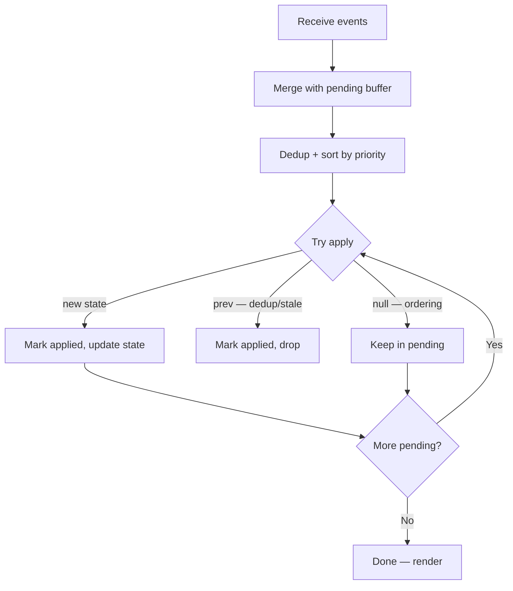
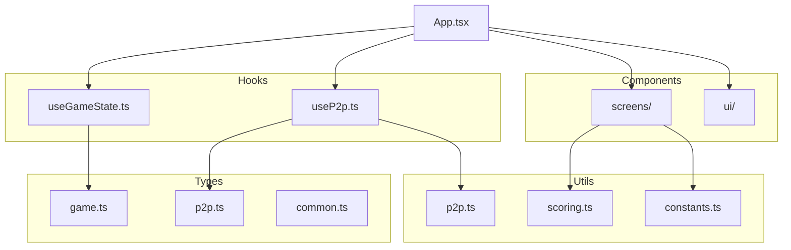

# Design — Name Place

## High-Level Architecture

No backend server. All game logic runs in the browser. Players communicate directly via WebRTC (PeerJS). The host acts as a relay node in a star topology.

## Game State Machine

All screens map to a `GameStatus`. Transitions are driven by `GameEvent` objects applied to the state machine.

## P2P Topology — Star with Host Relay

The host is the central node. Guests connect to the host, who relays events to all other peers. This avoids full-mesh complexity while keeping the architecture serverless.

## Event Flow

Events are the single source of truth. Every state change is an event that gets applied locally and broadcast to peers.

## Event Ordering & Sync

- **Event ID format:** `{peerId}-{sequenceNumber}` — globally unique
- **Vector clock:** each peer tracks the highest sequence number seen per peer
- **Deduplication:** applied event IDs stored in a `Set` — prevents double-application
- **Recovery:** if a peer suspects missing events, it sends `request-events-sync` with its vector clock; the responder replies with any events the requester hasn't seen

### Pending Buffer

Events that arrive out of order (e.g. `submit-round-readiness` before `wait-round-readiness`) are not discarded. Instead, `pureStateTransition` returns `null` for ordering rejections (vs `prev` for legitimate no-ops like duplicates). Rejected events go into a **priority-sorted pending buffer** and are retried after each successful apply.

Events are sorted by game-flow priority before retry:

| Priority | Event Types |
|---|---|
| 0 | `send-message`, `remove-player` (independent) |
| 1–2 | `init-game`, `add-player` |
| 3–5 | `set-waiting-peers`, `wait-round-readiness`, `submit-round-readiness` |
| 6–8 | `start-round`, `submit-answers`/`stop-round`, `submit-review` |

Tiebreaker within same priority: timestamp. Pending events expire after 30 seconds.

## P2P Message Types

| Message | Direction | Purpose |
|---|---|---|
| `join-handshake` | Guest → Host | New player announces itself |
| `handshake` | Host → Guest | Host acknowledges join |
| `peer-list` | Host → All | Broadcast list of connected peer IDs |
| `game-events` | Any → Host → All | Game state transitions |
| `request-events-sync` | Any → Any | Request missing events via vector clock |
| `events-sync-response` | Any → Requester | Reply with missing events |

## Module Structure

## Scoring

- 1 point per category if the answer is voted valid by majority (>50% of reviewers)
- 0 points if invalid or blank
- Cumulative across all rounds
- Final leaderboard ranks by total score
